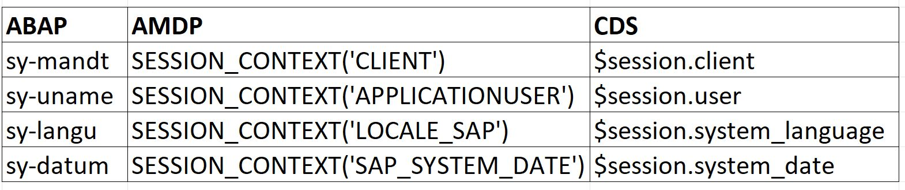

# Session Variables in ABAP, CDS, AMDP

In ABAP, we often used session variables. However, what would be their equivalent in AMDP or CDS? 
Here's a list of commonly used session variables in ABAP and their equivalent in AMDP/CDS

