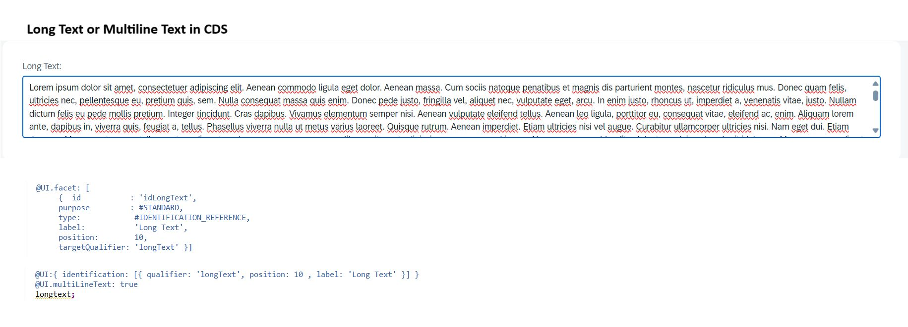

# Enable Long Text in CDS
Here's a useful CDS annotation that enables long text/multiline text functionality. If you want to create or display long text fields in your RAP application, you can easily achieve this by using the `@UI.multiLineText` annotation.

Additionally, if you want to display the long text as a separate tab in your application, you can create a new facet (with type `IDENTIFICATION_REFERENCE` or `FIELDGROUP_REFERENCE`) that references your long text field.

