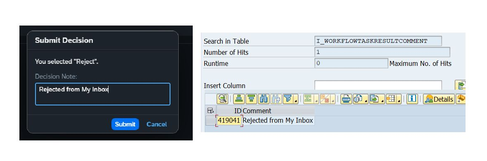

# Get the decision note (approver comments)
Try out this CDS/Class if you need to get the decision note (approver comments) from the work item.

`1. I_WorkflowTaskResultComment`\
`2. CL_WAPI_DECISION_COMMENT_QUERY`

Note: If you have this CDS in your system and if you want to retrieve old/completed work item notes, then execute the below report(If required) RSWW_SET_WORKITEM_COMMENTS.

